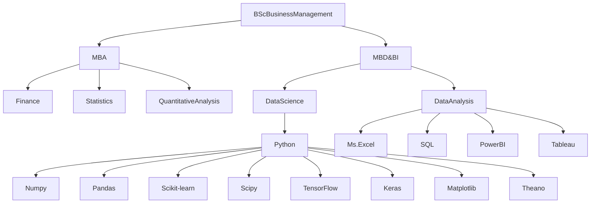

# About Me

<div class="justificado">
  <p>Apasionado por el análisis de datos y la toma de decisiones estratégicas, con experiencia en el sector público y privado.</p>
  
  <p><strong>Conocimiento:</strong></p>
  <ul>
    <li>Ciencia de Datos: Análisis de datos, machine learning, visualización de datos, big data.</li>
    <li>Análisis de Negocios: Modelos financieros, análisis de riesgos, optimización de procesos.</li>
    <li>Trading Cuantitativo: Desarrollo de estrategias algorítmicas, análisis de mercado, gestión de riesgos.</li>
  </ul>
  
  <p><strong>Formación:</strong></p>
  <ul>
    <li>MBA, especialización en Big Data and Business Intelligence.</li>
    <li>Ingeniero Comercial, Licenciado en Ciencias en la Administración de Empresas mención finanzas.</li>
  </ul>
  
  <p><strong>Experiencia:</strong></p>
  <p>Asesor Económico en la Secretaría Regional Ministerial de Economía. Experiencia en el sector privado en áreas de operaciones, administración, finanzas e inversiones, asesoría y docencia.</p>
  
  <p>Estoy en constante búsqueda de nuevos desafíos y oportunidades; si buscas un profesional comprometido, no dudes en contactarme.</p>
  
  <p>Puedes visitar mi perfil de LinkedIn: <a href="https://www.linkedin.com/in/esteban-ferraz/">https://www.linkedin.com/in/esteban-ferraz/</a></p>
  
  <p>#cienciadedatos #analisisdedatos #bigdata #businessintelligence #tradingcuantitativo #ingenierocomercial #cientificodedatos #analistadedatos</p>
</div>

</body>
</html>

<!--------------------------------------------------------------------------------------------------------------------------------------------------------->

# Social Media

<p align="center">
    <br/><br/><a href="https://www.linkedin.com/in/steban-ferraz/" target="_blank"></a>
    <a href="https://t.me/estebanferraz" target="_blank"></a>
<p/>

<!--------------------------------------------------------------------------------------------------------------------------------------------------------->
# Skills



<!--------------------------------------------------------------------------------------------------------------------------------------------------------->

# Tech Stack
<div align="center">  

              
</div> 

<!--------------------------------------------------------------------------------------------------------------------------------------------------------->
# GitHub Stats
<div align="center">  
  
<br/>
<br/>

</div> 

<!--------------------------------------------------------------------------------------------------------------------------------------------------------->
## Map

 ```geojson
{
  "type": "FeatureCollection",
  "features": [
    {
      "type": "Feature",
      "id": 1,
      "properties": {
        "ID": 0
      },
      "geometry": {
        "type": "Polygon",
        "coordinates": [
          [
              [-69.74,-33.54],
              [-71.74,-33.54],
              [-71.74,-33.54],
              [-69.74,-33.54],
              [-69.74,-33.54]
          ]
        ]
      }
    }
  ]
}
 ```

<!--------------------------------------------------------------------------------------------------------------------------------------------------------->
## GitHub Trophies
<div align="center">  
 

</div> 

<!--------------------------------------------------------------------------------------------------------------------------------------------------------->

### Random Dev Quote
<div align="center">  
  

</div> 

<!--------------------------------------------------------------------------------------------------------------------------------------------------------->

### Top Contributed Repo
<div align="center">  
  

</div> 

---
<div align="center">  
  
[](https://visitcount.itsvg.in)
</div> 

<!-- Proudly created with GPRM ( https://gprm.itsvg.in ) -->

<!--------------------------------------------------------------------------------------------------------------------------------------------------------->
<div align="center">  
  
<a href="http://s01.flagcounter.com/more/52r"></a>
</div> 
